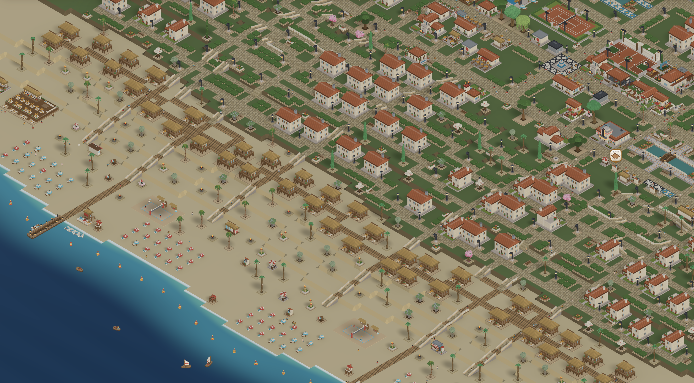

# Vox Resort



A voxel game where you build your own beach resort. Lay out paths, put up
hotels, bars and pools, and watch your guests arrive, enjoy their holiday, sleep
and leave a review when they check out.

- 🏗️ **Build**: place buildings, paths, stairs, ramps and plazas, shape the
  terrain, buy land and bulldoze what you no longer need
- 🧑‍🤝‍🧑 **Guests**: families with needs, thoughts and reviews who walk, swim,
  play, eat and sleep across the resort
- 🧹 **Staff**: hire cleaners, lifeguards, animators and housekeeping, and give
  them zones
- 💰 **Tycoon mode**: manage money, demand and ratings, or build freely
- 🎉 **Programme**: welcome events, acts and fireworks
- ☀️ **Day and weather**: calendar, sunsets, lamp light and changing weather
- 🚤 **Sea and beach**: boats, pedalos, balloons and a beach that gets dirty
- 💾 **Saves**: save and load resorts, installable as a PWA, touch friendly
- 🎵 **Sound**: music and ambient sounds

## Stack

| Concern         | Choice                                                      |
| --------------- | ----------------------------------------------------------- |
| Package manager | pnpm                                                        |
| Build / dev     | Vite 8                                                      |
| Language        | TypeScript 7                                                |
| Lint / format   | oxlint + oxfmt                                              |
| Renderer        | Three.js `WebGPURenderer` (`three/webgpu`), WebGL2 fallback |
| Voxels          | Divine Voxel Engine (`@divinevoxel/vlox`)                   |
| Models          | Authored in code in `voxel-gen/`                            |
| UI              | React 19, DOM overlay above the canvas                      |
| Tests           | Vitest                                                      |

## Getting started

The Node version is pinned in `.nvmrc`, which CI reads too. With
[nvm](https://github.com/nvm-sh/nvm), run this in the repo root:

```bash
nvm install     # first time, or after .nvmrc changes
nvm use         # every new shell
```

pnpm is pinned by `packageManager` in `package.json`.

```bash
pnpm install
pnpm preview    # render model thumbnails for the build palette
pnpm dev        # http://localhost:5173
```

| Script                              | Does                                          |
| ----------------------------------- | --------------------------------------------- |
| `pnpm dev`                          | dev server                                    |
| `pnpm build`                        | previews, type check, production build        |
| `pnpm preview`                      | render model previews                         |
| `pnpm preview:dist`                 | serve the production build                    |
| `pnpm test` / `pnpm test:watch`     | unit tests                                    |
| `pnpm typecheck`                    | type check                                    |
| `pnpm lint` / `pnpm lint:fix`       | oxlint, comment and sound checks              |
| `pnpm format` / `pnpm format:check` | format / check formatting                     |
| `pnpm fallow` / `pnpm fallow:audit` | dead code, duplication, boundaries            |
| `pnpm bench`                        | measure the renderer (needs `pnpm dev`)       |
| `pnpm sim:report`                   | run the simulation headless for days          |
| `pnpm sounds:fetch`                 | download and encode sounds (ffmpeg and unzip) |

## Structure

`src/features/` is grouped by feature. Each feature has `domain/` (pure,
unit-tested), `adapters/` (engine, DOM, GPU) and `components/` (React).
`domain/` may not import the other two; `.fallowrc.json` enforces this.
`src/app/` wires the features together.

The voxel models are art, not app code, and live in `voxel-gen/`. The app
derives everything from the model registry, so adding a model needs no change in
`src/`. See [voxel-gen/README.md](voxel-gen/README.md).

## Docs

- [docs/rendering.md](docs/rendering.md): pipeline, layout, terrain, building
  tools, lighting, weather rendering, benchmarks.
- [docs/crowd.md](docs/crowd.md): guests, staff, boats and the simulation behind
  them.
- [docs/sound.md](docs/sound.md): music, ambience, guests and UI cues in Web Audio.
- [docs/art-direction.md](docs/art-direction.md): references, palette, parts and
  modelling rules.
